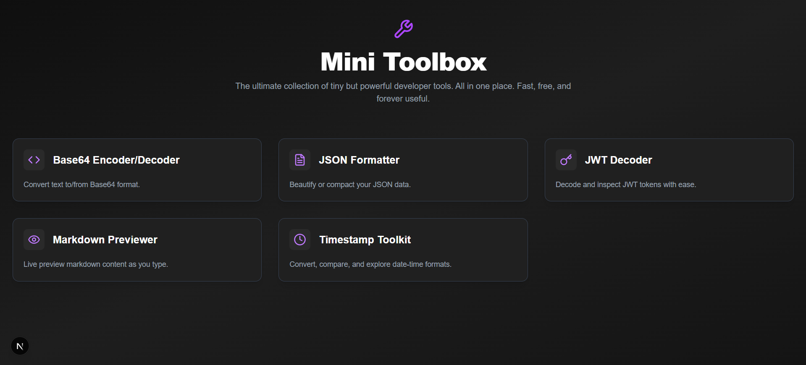

# Mini Toolbox

A modern, fast, and beautifully designed collection of essential developer utilities — all in one place. Built with **Next.js** and **Tailwind CSS**.

---

## ✨ Features

- **Markdown Previewer** — Live render markdown text
- **Base64 Encoder/Decoder** — Convert text to and from Base64 format
- **JSON Formatter** — Beautify and minify JSON effortlessly
- **JWT Decoder** — Decode and inspect JWT tokens
- **Timestamp Toolkit** — View, convert, compare timestamps across timezones

---

## Preview



---

## Getting Started

### 1. Clone the Repository

```bash
git clone https://github.com/YashLoriya02/toolbox.git
cd toolbox
````

### 2. Install Dependencies

```bash
npm install
# or
yarn
```

### 3. Start Development Server

```bash
npm run dev
# or
yarn dev
```

App will run at: [http://localhost:3000](http://localhost:3000)

---

## Tech Stack

* **Next.js** — React Framework
* **Tailwind CSS** — Utility-first CSS
* **Lucide React** — Icon set

---

## Folder Structure

```
app/                  → App Router pages (e.g., /tools/timestamps)
components/           → Reusable UI components (e.g., Input, Button)
styles/               → Global & Tailwind styles
tailwind.config.ts    → Tailwind configuration
```
